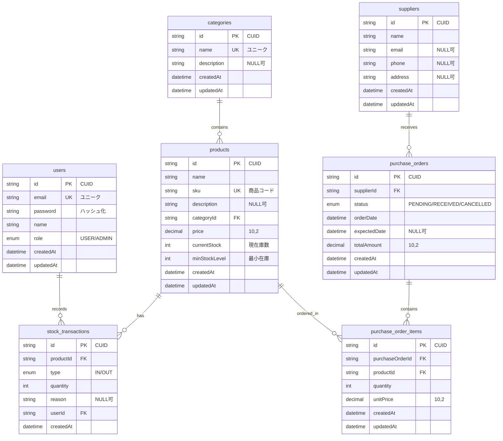

# ER図（Entity Relationship Diagram）

## 在庫管理システム データベース構造



## リレーションシップの説明

### 1. users → stock_transactions (1:N)
- **関係**: 1人のユーザーは複数の在庫取引を記録できる
- **カーディナリティ**: 1対多
- **外部キー**: `stock_transactions.userId` → `users.id`
- **削除制約**: なし（ユーザー削除時は取引履歴を保持）

### 2. categories → products (1:N)
- **関係**: 1つのカテゴリには複数の商品が属する
- **カーディナリティ**: 1対多
- **外部キー**: `products.categoryId` → `categories.id`
- **削除制約**: CASCADE（カテゴリ削除時は商品も削除）

### 3. products → stock_transactions (1:N)
- **関係**: 1つの商品は複数の在庫取引履歴を持つ
- **カーディナリティ**: 1対多
- **外部キー**: `stock_transactions.productId` → `products.id`
- **削除制約**: CASCADE（商品削除時は取引履歴も削除）

### 4. products → purchase_order_items (1:N)
- **関係**: 1つの商品は複数の発注明細に含まれる
- **カーディナリティ**: 1対多
- **外部キー**: `purchase_order_items.productId` → `products.id`
- **削除制約**: なし（商品削除時は発注明細を保持）

### 5. suppliers → purchase_orders (1:N)
- **関係**: 1つの仕入先は複数の発注を受ける
- **カーディナリティ**: 1対多
- **外部キー**: `purchase_orders.supplierId` → `suppliers.id`
- **削除制約**: なし（仕入先削除時は発注履歴を保持）

### 6. purchase_orders → purchase_order_items (1:N)
- **関係**: 1つの発注は複数の商品明細を含む
- **カーディナリティ**: 1対多
- **外部キー**: `purchase_order_items.purchaseOrderId` → `purchase_orders.id`
- **削除制約**: CASCADE（発注削除時は明細も削除）

## データフロー

### 在庫入庫フロー
```
1. 発注作成 (purchase_orders)
   ↓
2. 発注明細登録 (purchase_order_items)
   ↓
3. 入荷処理 (status: PENDING → RECEIVED)
   ↓
4. 在庫取引記録 (stock_transactions, type: IN)
   ↓
5. 在庫数更新 (products.currentStock += quantity)
```

### 在庫出庫フロー
```
1. 出庫登録 (stock_transactions, type: OUT)
   ↓
2. 在庫数更新 (products.currentStock -= quantity)
   ↓
3. 在庫アラートチェック (currentStock <= minStockLevel)
```

## 正規化レベル

このデータベース設計は**第3正規形（3NF）**を満たしています。

### 第1正規形（1NF）
- すべてのカラムがアトミック（分割不可能）な値を持つ
- 繰り返しグループが存在しない

### 第2正規形（2NF）
- 1NFを満たす
- 部分関数従属が存在しない（すべての非キー属性が主キー全体に従属）

### 第3正規形（3NF）
- 2NFを満たす
- 推移的関数従属が存在しない

### 非正規化の検討
パフォーマンス向上のため、以下の非正規化を検討可能：
- `products.currentStock`: 在庫取引から計算可能だが、頻繁にアクセスされるため非正規化
- `purchase_orders.totalAmount`: 明細から計算可能だが、パフォーマンスのため非正規化

## インデックス戦略

### 主キーインデックス（自動作成）
- すべてのテーブルの`id`カラム

### ユニークインデックス（自動作成）
- `users.email`
- `categories.name`
- `products.sku`

### 推奨される追加インデックス
```sql
-- 商品検索の高速化
CREATE INDEX idx_products_category_id ON products(categoryId);
CREATE INDEX idx_products_current_stock ON products(currentStock);
CREATE INDEX idx_products_name ON products(name);

-- 在庫取引の検索
CREATE INDEX idx_stock_transactions_product_id ON stock_transactions(productId);
CREATE INDEX idx_stock_transactions_user_id ON stock_transactions(userId);
CREATE INDEX idx_stock_transactions_created_at ON stock_transactions(createdAt DESC);
CREATE INDEX idx_stock_transactions_type ON stock_transactions(type);

-- 発注の検索
CREATE INDEX idx_purchase_orders_supplier_id ON purchase_orders(supplierId);
CREATE INDEX idx_purchase_orders_status ON purchase_orders(status);
CREATE INDEX idx_purchase_orders_order_date ON purchase_orders(orderDate DESC);

-- 発注明細の検索
CREATE INDEX idx_purchase_order_items_order_id ON purchase_order_items(purchaseOrderId);
CREATE INDEX idx_purchase_order_items_product_id ON purchase_order_items(productId);
```

## ビジネスルールの実装

### アプリケーションレベルで実装するルール

1. **在庫アラート**
   - `products.currentStock <= products.minStockLevel`の場合、アラート表示

2. **在庫取引の整合性**
   - 出庫時: `currentStock >= quantity`をチェック
   - トランザクション内で在庫数を更新

3. **発注の合計金額計算**
   - `totalAmount = SUM(quantity × unitPrice)`
   - 明細追加・更新時に再計算

4. **発注の入荷処理**
   - ステータスを`RECEIVED`に更新
   - 各明細に対して在庫取引（IN）を作成
   - 在庫数を更新
   - すべてトランザクション内で実行

5. **権限チェック**
   - `ADMIN`のみ: ユーザー管理、マスタデータ削除
   - `USER`: 通常の在庫操作

## スケーラビリティ考慮事項

### パーティショニング戦略
大量データが蓄積される場合の対策：

1. **stock_transactions テーブル**
   - 日付ベースのパーティショニング（月次または年次）
   - 古いデータはアーカイブテーブルに移動

2. **purchase_orders / purchase_order_items テーブル**
   - ステータスベースのパーティショニング
   - 完了した発注は別テーブルに移動

### レプリケーション
- マスター: 書き込み専用
- スレーブ: 読み取り専用（レポート、検索）

### キャッシング戦略
- 商品マスタ: Redis等でキャッシュ
- カテゴリ一覧: メモリキャッシュ
- 在庫数: リアルタイム性が必要なためキャッシュ不可
